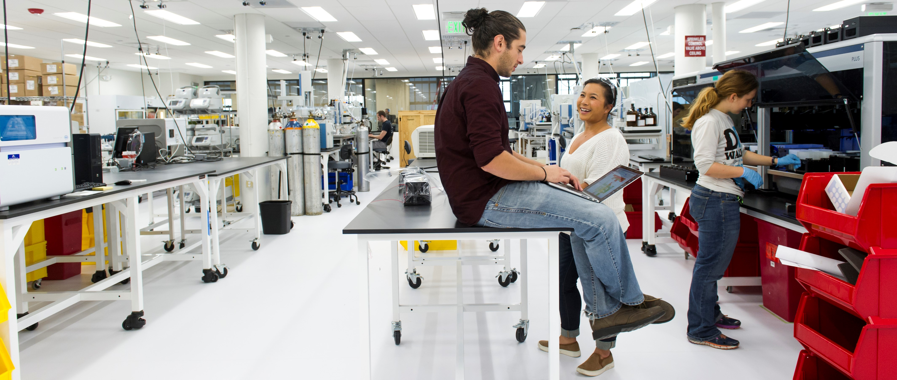

# Microbiology Lab

As a synthetic biology team that works with prokaryotes, we are, at our core, a **microbiology lab**. Classical microbiology labs grow and study _existing_ microbes, and as a synthetic biology group, we take it a step further and engineer _novel_ microbes to do useful things for society. The following section provides tips, tricks, protocols, and recipes to achieve your goals in our lab. To start the section off, we've listed a few **best practices** that we believe will help lead you to success.

#### Best Practices

1. Spend time on experimental design, iteration takes way longer.
2. Leverage existing knowledge across campus. If you're developing a novel protocol, consider if another lab on campus knows how to do it, and get in touch with them.
3. Define and use controls throughout all phases of genetic system construction and design.
4. Understand your cell's characteristic growth behavior. Measure a growth curve on the [Spark](../lab-equipment/microplate-reader.md) in advance of an experiment. Plan your schedule and dilutions accordingly, so you aren't in lab at late hours.
5. Follow [recipes](media-recipes.md) and protocols exactly, unless they aren't working.
6. Get multiple opinions \(on everything\).
7. Research the enzymes you are using. Many enzymes have unique behaviors that might result in protocol failure if you're unaware of them.
8. Sometimes if an approach has been exhausted, and is still failing, consider changing to another approach completely.
9. "Save" your progress by creating [glycerol stocks](bacteria-storage.md) and storing in the -80.
10. Be mindful of your lab mates. Clean shared lab spaces.

  

  

