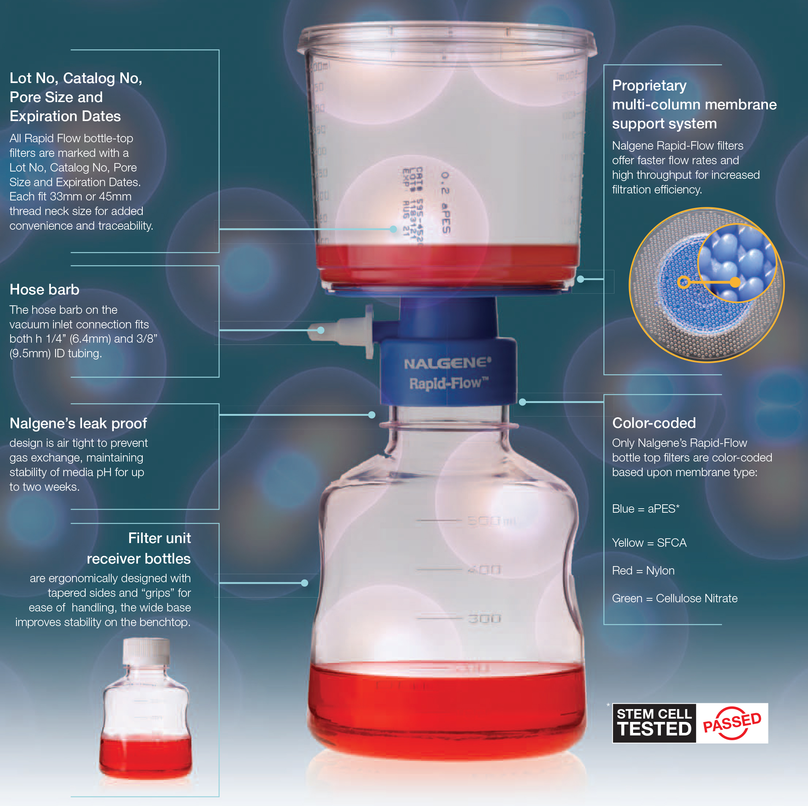

# Aseptic Technique

This page describes common laboratory procedures that can reduce the risk of culture contamination \(sepsis\), collectively referred as “aseptic technique.” 

## Working at your bench

### Bunsen burner

Bunsen burners are ubiquitous in experimental science, and for good reason too - they are multi-functional and are the single piece of equipment that allows aseptic technique at your bench. A Bunsen burner works by burning a continuous stream of flammable gas - usually natural gas \(methane\) - to \(1\) reduce the number of viable microorganisms suspended on dust particles in the air and \(2\) to flame things to sterilize them. To use your Bunsen burner:

1. Place the burner in the middle of your bench, ensuring that nothing is above it where the flame will be.
2. Open the valve just enough to hear a low-to-medium flow rate of gas.
3. Use a gas lighter \(striker\) to create a spark and light the flame above the burner \(**Figure 1**\). If your striker is not working, check to make sure there is flint and replace if needed. Apply pressure on the striker handle to create added friction between flint and striker element to increase sparks.

### Bench practices

1. Clean lab surfaces prior to and following use. Clean with 70% ethanol\*.
2. Light spray and rub of 70% ethanol on gloves helps keep them clean during cell culture work. Alternatively discard gloves and get a new pair.
3. Limit the duration that cultures or media are uncapped and exposed to air.
4. Keep petri dishes closed whenever possible.
5. Effectively sterilize inoculating loops, plate spreaders, and any other metal or flame-resistant tools that touched bacterial culture. Dip tool in 100% ethanol and flame. Flame inoculating loops until red hot to ensure complete sterilization.
6. Avoid breathing on or touching cultures or media.


\*To prepare 70% ethanol, combine 30 mL ddH2O and 70 mL 100% ethanol \(find in the flammables cabinet\), or a scaled volume with the same proportions. I like to put my 70% ethanol in a spray bottle for easy use at my bench. Find spare ethanol bottles around lab.


## Working in the laminar flow unit

In some cases you may want to work in the laminar flow hood for added security. The hood can be found in the Culture Room \(241B\) in the Shared Instrumentation laboratory space \(241\). Wear gloves and lab coat, and do not allow any foreign clothing or jewelry items contact the interior of the hood. Spray working surfaces down with 70% ethanol. Spray and wipe down glassware and tools with 70% ethanol before placing them in the hood. Follow same rules as working at your bench.

## Sterilizing Equipment and Reagents

### Autoclaving

The most common approach to sterilizing equipment and reagents is by using an [autoclave](https://consteril.com/how-does-a-laboratory-autoclave-work/), which uses stream to efficiently heat cells to break down their cell walls \(or membranes\), ultimately killing them. Things that are appropriate to autoclave include glassware, metal cell culture equipment, and media \(when specified\). Complete the following steps:

1. Prepare any media in either 250 mL, 500 mL or 1 L glass bottles.
2. Screw orange cap on, do not tighten cap completely. Turn cap a quarter turn counter clockwise from completely screwed on. This prevents pressurization of the head-space inside the bottle during the autoclave cycle, which can result in exploding bottles!
3. Take aluminum foil and place over all caps and empty glassware \(such as flasks\). Make sure foil covers all of the cap and a bit of the bottle sides. This helps keep your media sterile later during use.
4. Place a small piece of autoclave tape on top of the foiled cap. Autoclave tape will have black strips on it after sterilization, so you know what has been autoclaved.
5. Place all liquids \(media\) together in a autoclave bin, and place all dry goods together in another autoclave bin.
6. The autoclaves can be found in the room adjacent to the shared instrumentation lab space. Place either your dry or liquid goods bin\(s\) in the autoclave and run the appropriate cycle. You will need to get the credentials for our lab login to use the machine. Have a senior student show you how to initialize a cycle.
7. Allow the autoclave to fully depressurize and the cycle to end before opening the autoclave door.
8. **Warning, the contents are hot!** Use autoclave gloves to pick up the bin\(s\) and take them to your bench in lab. Allow items to cool as needed before use.


Wait to place VWR tape labels on your bottles after autoclaving! If you need to, write small labels on the autoclave tape so you know what each bottle is.


#### 

### Filter Sterilization

In some cases, you may need to use [filter sterilization](https://tuttnauer.com/blog/liquids-sterilization-by-filtration) to sterilize your liquids media. Here are some example cases when you may need to use filters: \(1\) **heat sensitive liquids**. Some media can be affected by autoclaving. For example, sugars are typically not suitable to sterilization using heat, \(2\) **small liquid volumes**, and \(3\) **time sensitive sterilization**. If you need to sterilize liquid media in a hurry, using filter sterilization can be a good option. There are two approaches we commonly use:

1. **Syringe with syringe filter**. Good for small liquid volumes. Insert the syringe without the filter, pull back on the plunge to pull up the liquid. Add the syringe filter to the syringe tip. Eject slowly in a sterile container by applying pressure on the plunge to push the liquid through the filter. Here's an [example video](https://www.youtube.com/watch?v=aHM_iu18m5E) demonstrating how to do this. 15 mL VWR tubes with caps can be considered sterile out of the bag and are a good container for filter sterilized media. Make sure you are using 0.22 µm pore size syringe filters, as these correctly filter out living cells.
2. **Nalgene® Rapid-Flow™ Filter Units**. Good for liquid volumes ranging from 200 mL to 1 L. Select the appropriately sized filter unit. Connect one end of a tube to a vacuum nozzle, and the other end of the tube to the hose barb at the neck of the unit \(**Figure 2**\). Pour your prepared media into the top of the unit, cover with the lid, and open vacuum valve to begin sterilization. The liquid should transfer to the receiver bottle. When all liquid has passed the filter, turn off the vacuum, remove the filter, and cap the bottle. You can leave the media in this bottle, as it is sterile out of the bag. Make sure to label your bottle.


Make sure to filter sterilize this media at your bench using proper aseptic technique as discussed above. Make sure to handle liquids under flame during and following sterilization.


