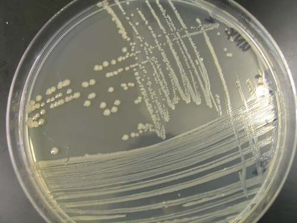

# Growing Bacteria

Any standard microbiology textbook, wet lab manual, or online tutorial will describe how to grow bacteria, so I'll keep this page brief. I specifically put together this page to make note of advanced techniques to help save time and reagents. Depending on the workflow, we routinely use any of the following approaches. Typically culturing bacteria falls under either liquid culture or growth on solid media, and there are a number ways you can accomplish growth in either scenario. Check it out:


Make sure to be using best practices including sterile \(aseptic\) technique and appropriate selection when growing or working with cell culture!


## Liquid Culture

Liquid culture simply involves adding bacteria to liquid media, and allowing the cells to grow. You can grow cells in different volumes. Here are some appropriate vessels for various volumes:

| Culture Volume Range | Appropriate Types of Vessels |
| :--- | :--- |
| 100-300 µL | 96-well microplates \(see [Microplate Assays](../../test/characterize-your-system/microplate-fluoresence.md)\) |
| 300-800 µL | 96-deep well plates\* |
| 1-5 mL | Polypropylene culture tubes\* |
| &gt;5 mL | Erlenmeyer flasks \(various sizes\)\* |

\*See [Shaker Incubators](../lab-equipment/shaker-incubators.md)

Most protocols will describe how to grow cells for that given protocol. For example, plasmid extractions \(also called [Minipreps](../../build/dna/plasmid-extraction.md)\) generally call for a 5 mL culture. If you're working with standard lab strains, you are likely using [LB media](media-recipes.md#lb-media) or maybe a defined minimal media, and you likely are using an antibiotic to prevent other things growing and to ensure your strain has the correct genotype \(either plasmid or genome encoded resistance\).

#### Adding cells

To add cells to liquid culture, you can either add another liquid culture with a pipette or you can "charge" a loop by touching a colony on a plate, another liquid culture, or a glycerol stock and then by putting the loop in the new media. Once you have used a charged loop, make sure to dip it in 100% ethanol and then hold it in a Bunsen burner flame until red hot to sterilize it.

#### Fermentation

To date \(11-13-18\) we don't do any fermentation in-lab, but rather outsource fermentation jobs to the Fermentation Core Facility \(downstairs in the ABE building\). In the future, it is very possible that we purchase or build bench-top bioreactor\(s\) or continuous culture setups. Usage and maintenance of such devices would be best documented in separate pages under Microbiology 101.

## Solid Media \(Petri Dishes\)

Solid culture involves adding the bacteria to a solid media surface and allowing the cells to grow. Generally, you are looking to spread the bacteria out in such a way that individual colonies form. A colony is a visible mass of microorganisms originating from a single cell. We sometimes refer to colonies as isogenic, or having the same genotype. The small amount of growth from single cell to colony is typically not enough time for genetic drift \(i.e. mutation\), and you can generally be confident that picking from a single colony will give you a uniform population phenotype. Here are some approaches.


When you look at colonies on a plate, do they have the same morphology \(shape, size, features\)? If they don't, that means you likely have different bacteria strains or genetic differences within the same strain \(**Fig. 1**\). Picking a colony is a good way of **isolating** a desired strain from a mixed culture \(referred to as an isolate\). With practice, you'll be able to distinguish your desired strain from incorrect strains or other microorganisms.


#### Streaking

If you have a [glycerol stock](bacteria-storage.md) or stab culture of bacteria and need to purify plasmid DNA from it, you will want to isolate an individual clonal population \(single colony\) of bacteria from this stock. Using a single colony from a freshly streaked agar plate to inoculate a bacterial culture for DNA purification will minimize the chance of having a mixture of plasmids in your purified DNA. Use the following steps to streak out your cells:

1. Obtain an LB agar plate with appropriate antibiotic. Label it.
2. Sterilize your lab bench.
3. Obtain the appropriate glycerol stock or stab.
4. Using a sterile loop, touch the bacteria stock.
5. Gently spread the bacteria over a section of the plate.
6. Sterilize your loop, and spread over a new region by first dragging your loop over a portion of the previous region to create a dilution with fewer cells. Repeat this 4-5 times \(**Fig. 2**\).
7. Incubate at the appropriate temperature in a standing incubator, for the appropriate amount of time. For _E. coli_ that is in the 37**°**C incubator for 12-16 hours \(depending on antibiotic, sub-strain, stress of your system\).
8. You have fresh isolated colonies \(**Fig. 3**\)! Store in the 4**°**C fridge.


You can find more details and video [here](https://www.addgene.org/protocols/streak-plate/) describing this protocol.


#### Spread Plating

[https://www.youtube.com/watch?v=esunMqaHmbU](https://www.youtube.com/watch?v=esunMqaHmbU) \(with spreader\)

[https://www.youtube.com/watch?v=nRRVWJQe6F8](https://www.youtube.com/watch?v=nRRVWJQe6F8) \(with beads\)

#### Spot Plating

[https://www.youtube.com/watch?v=kSgV-deskFo](https://www.youtube.com/watch?v=kSgV-deskFo) \(good demo\)

