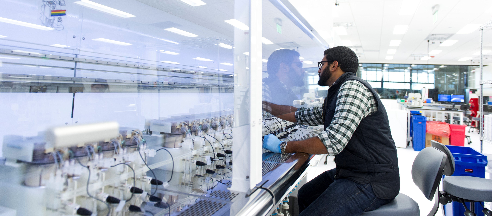

# Personal Protective Equipment

**The following PPE is required at all times in the lab, unless otherwise stated:**

1. Disposable gloves\*
2. Pants
3. Close-toed shoes
4. Eye protection \(safety glasses, goggles, or vision glasses\)
5. Lab coat \(optional, protocol specific\)
6. Respirator \(protocol specific\)

\*Do not wear disposable gloves in the hallway, and do not open doors outside of the lab with gloves on. Dispose of the gloves, and get a new pair as needed. Avoid reusing your gloves to minimize contamination to you and your cultures.

